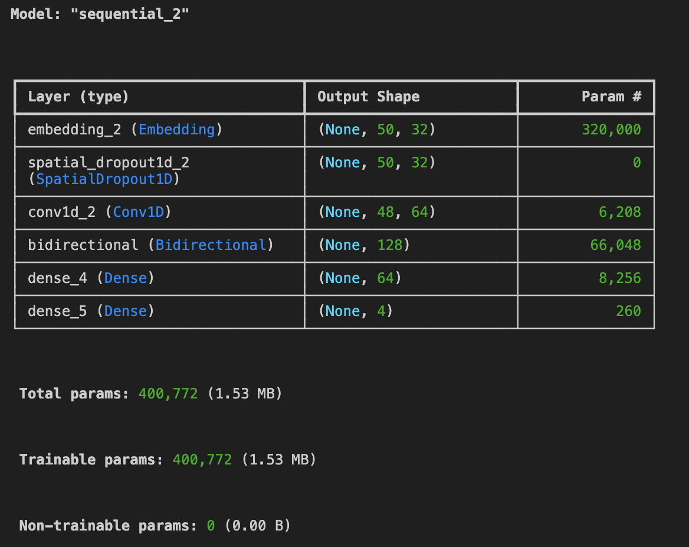
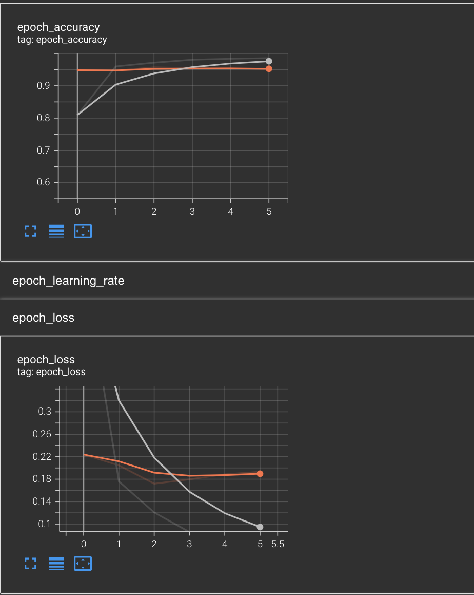
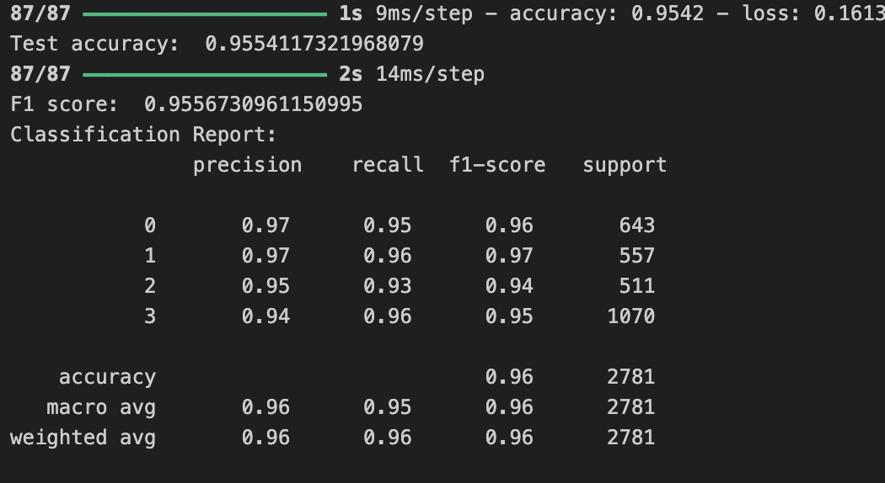

# NLP Text Classification for Product Categorisation #
This is a classification task in the context of Natural language Processing (NLP) for an e-commerce platform.
The task is to classify products based on the product description into 4 categories:
  1. Household
  2. Electronics
  3. Books
  4. Clothings & Accessories

## Manual ##
You can reproduce the code by following these steps:
  1. Clone the repository
  2. cd into this repository
     ```

     cd ecommerce
     ```
  3. Run the following command
     ```

     python3 ecommerce.py
     ```

Alternatively, you can run on VSCode.
If you want to use only the trained model, there is a .h5 model saved in the saved_models folder, together with the tokenizer. 
To use the tokenizer, there is a helper file "tokenizer_to_json.py" that has the function load_tokenizer which will use the tokenizer.json settings

## Architecture of the model ##



## Training of the model Using Tensorboard as visualisation ##



## Performance of model on test dataset ##



## Source ##
Datasets is obtained from : https://www.kaggle.com/datasets/saurabhshahane/ecommerce-text-classification
